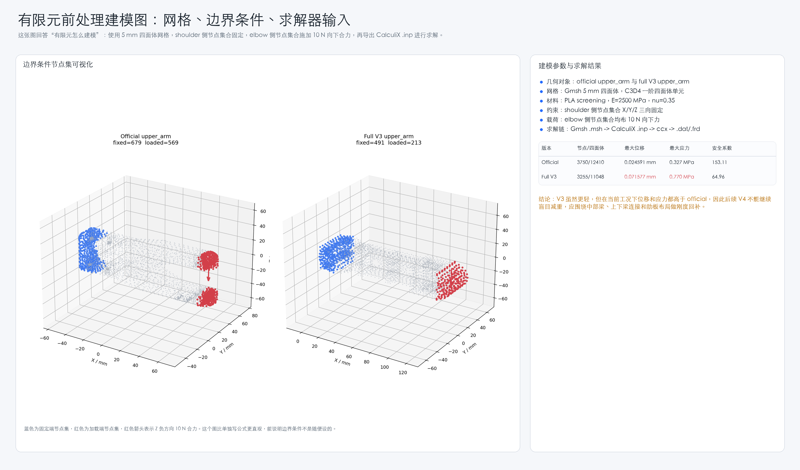
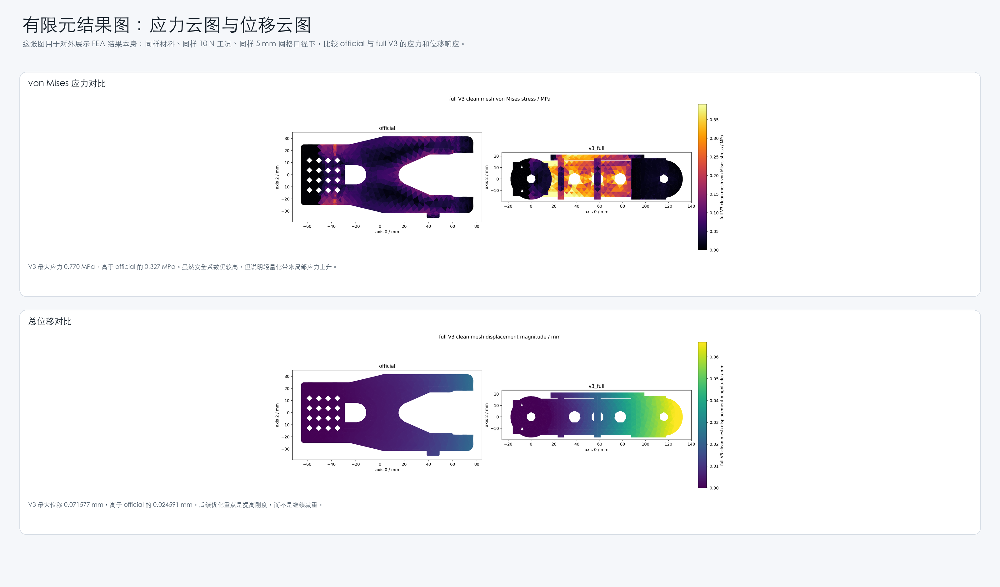

# SO-101 AI-Assisted CAD/CAE Robotic Arm Structure Project

> 基于开源 SO-101 follower arm 的 AI 辅助机械结构建模、参数化 CAD 迭代、URDF/PyBullet 回归验证和 CalculiX/Gmsh 有限元分析项目。


## 项目定位

这个项目的目标不是只生成一个“看起来像机械臂”的模型，而是建立一条可以面向机械结构岗位展示的工程链：

1. 复现 SO-101 机械臂 baseline，并读取 CAD/STL/URDF 结构资源。
2. 对 official upper arm 做工作空间、静载力矩和结构瓶颈分析。
3. 使用 AI + CAD-as-code 思路生成 V1/V2/V3 参数化 upper arm。
4. 导出 STEP/STL，做孔位、沉孔、标准件装配和 URDF smoke test。
5. 使用 Gmsh / CalculiX / PyVista 对 official 与 V3 做同边界条件有限元对比。
6. 把模型、图片、数据、脚本和中文报告整理成可复核的作品集。

## 核心结果

| 版本 | 定位 | PLA 质量估算 | 体积变化 | 装配校核 | PyBullet smoke test |
|---|---|---:|---:|---|---|
| official | 开源 baseline | 145.49 g | 0.00% | 官方基准 | 通过 |
| V1 | 轻量化概念版 | 116.42 g | -19.98% | 关键接口不完整 | 通过 |
| V2 | 装配接口增强版 | 122.30 g | -15.94% | PASS | 通过 |
| V3 | 孔系余量修正版 | 126.35 g | -13.16% | PASS | 通过 |

full V3 clean FEA screening 结果：

| 版本 | 网格尺寸 | 节点数 | 四面体数 | 质量 | 最大位移 | 最大 von Mises | 屈服安全系数 |
|---|---:|---:|---:|---:|---:|---:|---:|
| official | 5.0 mm | 3750 | 12410 | 144.07 g | 0.024591 mm | 0.327 MPa | 153.11 |
| full V3 | 5.0 mm | 3255 | 11048 | 127.49 g | 0.071577 mm | 0.770 MPa | 64.96 |

结论：V3 相对 official 质量降低约 `11.51%`，但最大位移和应力上升，说明后续 V4 应优先加强中部梁、上下梁连接和肋板布局，而不是继续盲目减重。

## 仓库结构

```text
docs/      中文项目报告、流程说明、FEA 结论、工程说明
figures/   建模、仿真、FEA 和数据图
models/    V1/V2/V3 STEP/STL、装配检查模型、FEA clean STEP
data/      CSV/JSON 指标、孔位检查、力矩对比、FEA 结果
src/       CAD 生成、结构分析、URDF smoke test、FEA 脚本
tools/     项目辅助脚本
projects/  可独立查看的工程模块资料包
```

## 推荐阅读顺序

1. [`docs/01_project_overview_zh.md`](docs/01_project_overview_zh.md)
2. [`docs/02_cad_iteration_v1_v2_v3_zh.md`](docs/02_cad_iteration_v1_v2_v3_zh.md)
3. [`docs/03_fea_full_v3_clean_zh.md`](docs/03_fea_full_v3_clean_zh.md)
4. [`docs/04_text_to_cad_open_source_workflow_zh.md`](docs/04_text_to_cad_open_source_workflow_zh.md)
5. [`projects/text_to_cad_parametric_cad/README_zh.md`](projects/text_to_cad_parametric_cad/README_zh.md)
6. [`docs/08_text_to_cad_parametric_cad_workflow_zh.md`](docs/08_text_to_cad_parametric_cad_workflow_zh.md)
7. [`docs/05_project_explanation_zh.md`](docs/05_project_explanation_zh.md)

## 工程模块与证据目录

| 工程模块 | GitHub 对应内容 |
|---|---|
| Text-to-CAD机械结构参数化建模与工程校核流程 | [`projects/text_to_cad_parametric_cad/README_zh.md`](projects/text_to_cad_parametric_cad/README_zh.md)、[`docs/08_text_to_cad_parametric_cad_workflow_zh.md`](docs/08_text_to_cad_parametric_cad_workflow_zh.md) |
| SO-101机械臂结构仿真、装配验证与有限元分析 | [`docs/02_cad_iteration_v1_v2_v3_zh.md`](docs/02_cad_iteration_v1_v2_v3_zh.md)、[`docs/03_fea_full_v3_clean_zh.md`](docs/03_fea_full_v3_clean_zh.md)、`figures/fea/`、`data/fea/` |

## 关键图片






## 复现实验环境

主要 Python 依赖：

- CAD 建模：`build123d`, `OCP`, `trimesh`
- 仿真/数据：`numpy`, `scipy`, `matplotlib`, `pybullet`
- 网格与 FEA 后处理：`gmsh`, `meshio`, `pyvista`
- 求解器：`CalculiX ccx`

完整环境建议见 [`docs/06_toolchain_feasibility_zh.md`](docs/06_toolchain_feasibility_zh.md)。

## 说明

本仓库是作品集整理版，只包含公开展示所需的模型、图片、数据、报告和代码。个人资料、联系方式、服务器凭据、临时缓存和完整私有工作目录没有上传。

SO-101 baseline 资源来自开源项目，相关第三方资源权利归原项目所有；本仓库中的 AI 辅助 CAD/CAE 脚本、分析报告和整理图表用于学习与作品集展示。
