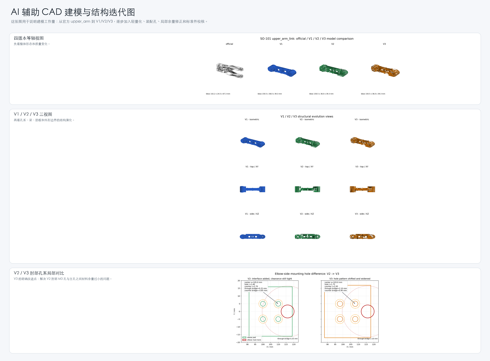
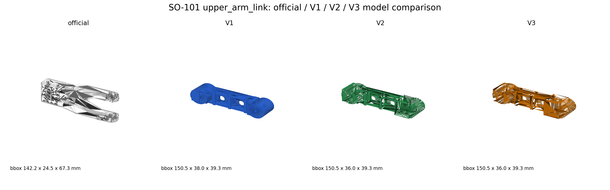
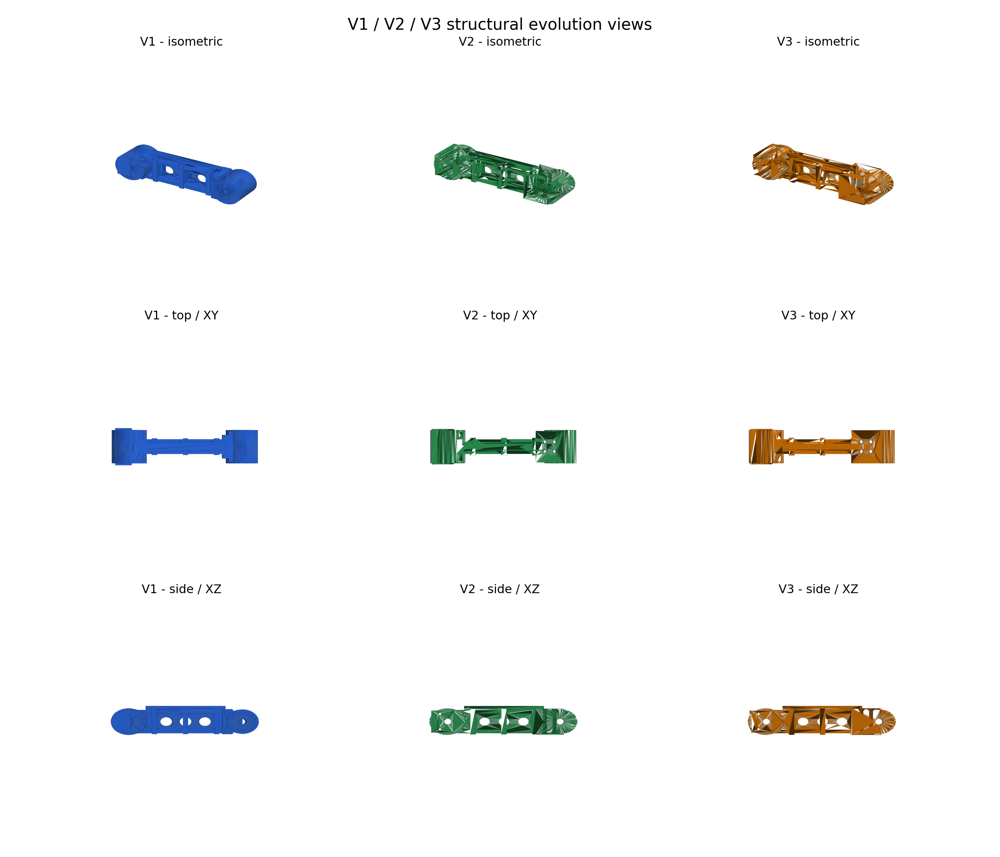
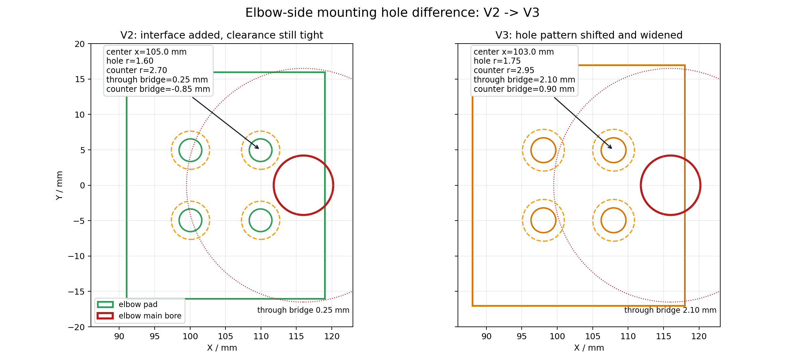

# Text-to-CAD 参数化机械结构建模与工程校核

本目录把 Text-to-CAD 相关的模型、图片、数据和代码集中在一起，便于独立查看这一模块的工程链路。

## 模块目标

将自然语言结构需求转化为可复现的参数化 CAD 脚本，并通过 STEP/STL 导出、B-Rep 特征校核、标准件装配检查、URDF 回归和 FEA 前处理验证模型可用性。

## 目录结构

```text
figures/      CAD 迭代图、三视图、孔系局部差异图
data/         体积/质量指标、孔位校核、装配检查 JSON/CSV
code/cad/     V1/V2/V3 CAD 生成、验证、孔位检查和 URDF smoke test 代码
models/       V1/V2/V3 STEP/STL 模型
assemblies/   V2/V3 简化标准件装配 STEP/STL
reports/      V1/V2/V3 设计报告和孔位校核报告
```

## 核心流程


## 模型迭代

| 版本 | 文件 | 设计目标 | 工程校核 |
|---|---|---|---|
| V1 | `models/upper_arm_v1_ai_rebuild.step` | 轻量化概念重建 | 可导出 STEP/STL，关键装配接口不足 |
| V2 | `models/upper_arm_v2_ai_rebuild.step` | 补齐 M3 孔、沉孔、肩部夹紧/定位孔 | 装配表达更完整，肘部孔系余量偏紧 |
| V3 | `models/upper_arm_v3_ai_rebuild.step` | 修正肘部孔位、孔径、沉孔和局部 pad | 孔位复核 PASS，标准件装配检查 PASS |

## 关键图









## 数据文件

关键汇总：

- `data/upper_arm_v1_v2_v3_key_metrics.csv`

V1/V2/V3 CAD 验证：

- `data/upper_arm_v1_validation.json`
- `data/upper_arm_v2_validation.json`
- `data/upper_arm_v3_validation.json`

孔位与圆柱特征校核：

- `data/upper_arm_v1_mounting_check.json`
- `data/upper_arm_v2_mounting_check.json`
- `data/upper_arm_v3_mounting_check.json`
- `data/upper_arm_v1_mounting_cylinders.csv`
- `data/upper_arm_v2_mounting_cylinders.csv`
- `data/upper_arm_v3_mounting_cylinders.csv`

标准件装配检查：

- `data/upper_arm_v2_standard_part_check.json`
- `data/upper_arm_v2_standard_part_checks.csv`
- `data/upper_arm_v3_standard_part_check.json`
- `data/upper_arm_v3_standard_part_checks.csv`

## 代码入口

CAD 生成：

```bash
python code/cad/upper_arm_v1/upper_arm_v1_cad.py
python code/cad/upper_arm_v2/upper_arm_v2_cad.py
python code/cad/upper_arm_v3/upper_arm_v3_cad.py
```

几何与孔位校核：

```bash
python code/cad/upper_arm_v1/validate_upper_arm_v1.py
python code/cad/upper_arm_v2/validate_upper_arm_v2.py
python code/cad/upper_arm_v3/validate_upper_arm_v3.py

python code/cad/upper_arm_v1/upper_arm_v1_mounting_check.py
python code/cad/upper_arm_v2/upper_arm_v2_mounting_check.py
python code/cad/upper_arm_v3/upper_arm_v3_mounting_check.py
```

标准件装配检查：

```bash
python code/cad/upper_arm_v2/upper_arm_v2_standard_part_assembly_check.py
python code/cad/upper_arm_v3/upper_arm_v3_standard_part_assembly_check.py
```

URDF / PyBullet 回归：

```bash
python code/cad/upper_arm_v1/upper_arm_v1_urdf_smoke.py
python code/cad/upper_arm_v2/upper_arm_v2_urdf_smoke.py
python code/cad/upper_arm_v3/upper_arm_v3_urdf_smoke.py
```

## 工程结论

Text-to-CAD 在本项目中的作用不是替代工程验证，而是提高结构方案生成和参数化建模效率。最终模型必须经过 STEP 特征级孔位校核、标准件装配检查、URDF/PyBullet 回归和 FEA 结果约束，才能进入下一轮结构设计。
